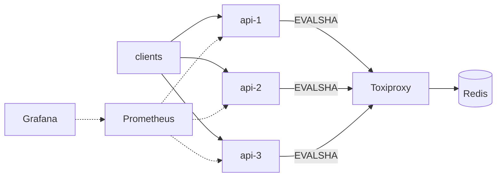

# Distributed Rate Limiter

[](https://github.com/ParkerHarrelson/distributed-rate-limiter/actions/workflows/ci.yml)


A rate limiter that enforces per-user, per-endpoint and cluster-wide limits
across several stateless service replicas, with the state in Redis and the
algorithms in atomic Lua scripts. Four algorithms (fixed window, sliding log,
sliding window counter, token bucket) are implemented behind one interface so
they can be swapped with an environment variable and compared under identical
traffic. The repo ships with a three-replica Docker environment, fault
injection, Prometheus/Grafana dashboards and a load generator that can
reproduce the classic window-boundary burst on demand.



## Quick start

Requires Docker and Go 1.27.

```sh
make demo
```

That builds the image, starts 3 replicas + Redis + Toxiproxy + Prometheus +
Grafana, sends 60 requests as one user round-robin across the replicas
(limit is 50 per 10s), prints the `X-RateLimit-*` headers of a denied request,
then runs 20 seconds of steady load at twice the allowed rate and prints a
summary table. Grafana is at http://localhost:3000.

```sh
ALGORITHM=token_bucket make restart-api     # swap algorithm, keep everything else
make loadgen ARGS="-mode boundary -period 10s -burst 50 -users 3"
make chaos-partition STATE=on               # black-hole Redis; watch the dashboard
make chaos-reset
make down
```

## What is inside

| | fixed window | sliding log | sliding counter | token bucket |
|---|---|---|---|---|
| state per key | 2 ints | N timestamps | 3 ints | float + timestamp |
| boundary burst | 2x limit | none | ~none | up to `burst` by design |
| separates rate from burst | no | no | no | **yes** |
| in-memory | `memory.FixedWindow` | `memory.SlidingLog` | `memory.SlidingCounter` | `memory.TokenBucket` |
| Redis (Lua) | `fixedwindow.lua` | stretch | `slidingwindow.lua` | `tokenbucket.lua` |

Every implementation must pass the same [conformance suite](internal/limiter/conformance/conformance.go),
which pins down the observable contract (exact capacity under 32 concurrent
goroutines, honest `Retry-After`, algorithm-specific boundary behaviour). The
suite runs with a fake clock for the in-memory versions and against a real
Redis for the Lua versions.

Policy is YAML ([configs/limits.yaml](configs/limits.yaml)): rules with a
scope (`user`, `endpoint`, `user_endpoint`, `global`), optional user/endpoint
patterns, and a limit. All matching rules apply.

## Measured results

See [docs/results.md](docs/results.md) for the steady-state accuracy,
boundary-burst and latency comparisons, and
[docs/failure-scenarios.md](docs/failure-scenarios.md) for what happens when a
replica dies, Redis disappears, Redis is partitioned, or Redis is merely slow.

## Design

[docs/architecture.md](docs/architecture.md) covers the request path, why Lua
scripts rather than transactions, why Redis is the clock rather than the
replicas, the single-key-per-check rule that keeps it Redis-Cluster-safe, and
the alternatives that were rejected.

## Layout

```
cmd/server            one API replica
cmd/loadgen           open-loop load generator (steady and boundary modes)
internal/limiter      Limiter interface + Decision
  memory/             in-process algorithms
  redis/              Lua scripts + wrappers
  conformance/        shared acceptance suite
internal/policy       rules, scopes, key derivation, YAML
internal/resilience   fail-open / fail-closed / local fallback + circuit breaker
internal/httpapi      middleware, headers, demo endpoints
internal/metrics      Prometheus instruments
deploy/               Dockerfile, docker-compose, toxiproxy config
configs/              limits.yaml, prometheus, grafana provisioning + dashboard
scripts/              demo, bench, chaos
docs/                 architecture, curriculum, results, failure scenarios
```

## How this was built

This is a learning project. The scaffolding (harness, tests, infrastructure,
tooling, docs) was built with an AI pair acting as the infrastructure
engineer; the rate-limiting algorithms, Lua scripts and resilience layer are
hand-written against that harness, exercise by exercise, following
[docs/curriculum.md](docs/curriculum.md). The fixed-window implementation in
each backend is the worked reference; the rest are the exercises. If a stub
still says `ErrNotImplemented`, that exercise has not been reached yet.

## License

MIT
