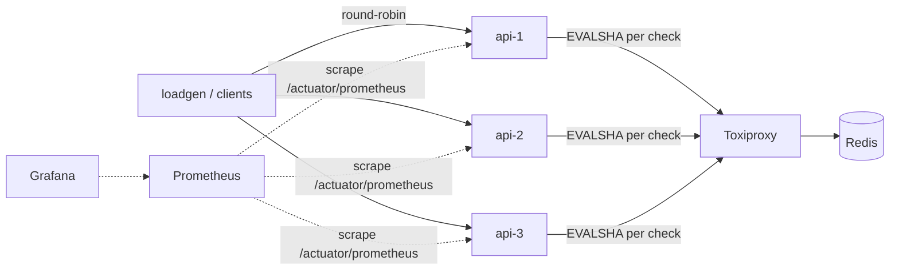
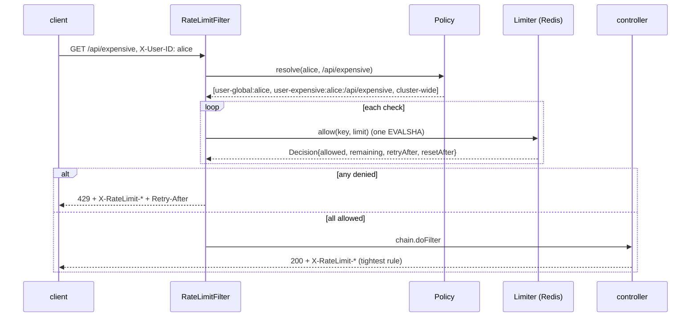

# Architecture

## Problem

Several stateless replicas of an HTTP API must enforce shared limits:
per user, per endpoint, per (user, endpoint) and cluster-wide. A client that
spreads requests across replicas must still see exactly one budget.

## Topology

- **api-N**: the `server` module, a Spring Boot application on virtual
  threads. Stateless. Every request is resolved against the policy into zero
  or more checks; each check is one atomic call to Redis.
- **Redis**: the only shared state. Each limiter key is one hash; each
  algorithm is one Lua script.
- **Toxiproxy**: sits between the replicas and Redis so latency, timeouts and
  partitions can be injected without touching either side.
- **Prometheus / Grafana**: per-instance and aggregate views of decisions,
  latency, errors and fallback behaviour.

## Request path

## Modules and packages

| module / package | responsibility | owner |
|---|---|---|
| `core` `…core` | `Limiter`, `Limit`, `Decision`, exceptions | scaffold |
| `core` `…core.clock` | `MutableClock`, `SkewedClock`, nanosecond helpers | scaffold |
| `core` `…core.memory` | in-process algorithms (fixed window reference; token bucket, sliding log, sliding counter exercises) | exercises |
| `core` `…core.redis` | Lettuce script runner, Lua scripts + thin wrappers (fixed window reference; token bucket, sliding counter exercises) | exercises |
| `core` `…core.policy` | rules, scopes, key derivation, YAML loading | scaffold |
| `core` `…core.resilience` | fail-open/closed/local + circuit breaker | exercise |
| `core` test `…core.contract` | the shared acceptance suite every limiter must pass | scaffold |
| `core` jmh | JMH micro-benchmarks | scaffold |
| `server` | Spring Boot wiring, `RateLimitFilter`, controllers, Micrometer metrics | scaffold |
| `loadgen` | open-loop load generator (steady and boundary modes) | scaffold |

`core` has no Spring dependency on purpose: the algorithms can be read,
unit-tested with a fake clock, and benchmarked without a container starting.

## Key decisions

**Lua scripts for atomicity.** A rate-limit check is read-modify-write. Redis
executes a script as one indivisible unit on its single command thread, so
two replicas can never both observe "1 token left" and both take it. The
alternatives (`WATCH`/`MULTI` optimistic transactions, or client-side CAS
loops) work but cost round trips under contention, which is exactly when a
rate limiter is busiest.

**Redis is the clock.** Scripts call `TIME` rather than trusting a timestamp
argument. Replica clocks drift; with client time, a replica 2s ahead would
open new fixed windows early and let a client double-dip. The cost is that
scripts are non-deterministic, which Redis >= 5 handles by replicating
effects rather than the script. `CLOCK_SKEW` on the memory backend exists to
demonstrate the failure this avoids.

**One key per check, one hash per key.** Every algorithm stores its state in
a single hash at `rl:<rule>:<dimensions>` and every script touches only
`KEYS[1]`. That keeps the design Redis-Cluster-safe (a script may only touch
keys in one hash slot) and makes TTL management uniform: the whole state
expires together.

**Absolute windows.** `index = floor(now / period)`. Every replica and every
key agree on boundaries without coordination, and the load generator can
predict them, which is what makes the boundary-burst experiment possible.

**Uniform reply shape.** Every script returns
`{allowed, limit, remaining, retry_after_ms, reset_after_ms}`. The Java
wrappers are therefore identical and interchangeable; the algorithm lives
entirely in Lua and can be diffed and reviewed as such.

**One Lettuce connection, short timeout, reject-while-disconnected.** Lettuce
multiplexes all callers over a single connection, which is the right shape
for tiny scripted commands. The command timeout is 50ms by default: a rate
limiter slower than the request it protects is worse than none.
`DisconnectedBehavior.REJECT_COMMANDS` fails fast during an outage instead of
queueing a backlog that floods Redis when it returns.

**Policy composition is AND.** A request must pass every matching rule.
Consequence: a token may be consumed from rule A even though rule B denies
the request. Documented as a known trade-off; Exercise 6 explores fixes.

**Fail behaviour is a separate layer.** The filter returns 503 on limiter
error. The resilience wrapper (Exercise 5) decides between open / closed /
local fallback and adds a circuit breaker so that a partition costs one
timeout per cooldown rather than one per request.

**Virtual threads.** `spring.threads.virtual.enabled=true`, so a blocking
Redis call per request does not pin a platform thread. This is what makes the
simple synchronous Lettuce call acceptable at thousands of requests per second.

## Alternatives considered

- **Local buckets with periodic sync** (each replica enforces `limit / N`
  and reconciles): no shared hot path, but accuracy depends on even load
  balancing and N is rarely stable under autoscaling. Kept as the *fallback*
  mode, not the primary.
- **Bucket4j with its Redis/JCache backends, or Resilience4j RateLimiter**:
  production-ready, and worth reading. Using them would remove the part of
  the project that teaches anything.
- **A dedicated rate-limit service** (Envoy `ratelimit`, a gRPC sidecar):
  the right shape at scale, but it moves the interesting logic behind an RPC.
- **Redis Cell / Redis Functions**: `CL.THROTTLE` is a GCRA implementation
  as a module; Functions are Lua scripts with a lifecycle. Plain `EVALSHA` is
  the most portable.
- **Client-passed timestamps**: rejected, see above.

## Observability

Micrometer meters, exported at `/actuator/prometheus`:

| meter | Prometheus name | tags | use |
|---|---|---|---|
| `ratelimiter.decisions` | `ratelimiter_decisions_total` | rule, algorithm, result | allowed/denied/error rates, per rule |
| `ratelimiter.check.duration` | `ratelimiter_check_duration_seconds_*` | algorithm, backend | Redis round-trip cost of a check |
| `ratelimiter.backend.errors` | `ratelimiter_backend_errors_total` | | outage detection |
| `ratelimiter.fallback.decisions` | `ratelimiter_fallback_decisions_total` | mode, result | what the resilience layer did |
| `http.server.requests` (Boot) | `http_server_requests_seconds_*` | uri, status | end-to-end view |
| `ratelimiter.info` | `ratelimiter_info` | instance_id, algorithm, backend, fail_mode | dashboard labels |

Response headers: `X-RateLimit-Limit`, `X-RateLimit-Remaining`,
`X-RateLimit-Reset` (seconds), `X-RateLimit-Policy` (rule name),
`Retry-After` on 429, `X-Instance` (which replica answered).
